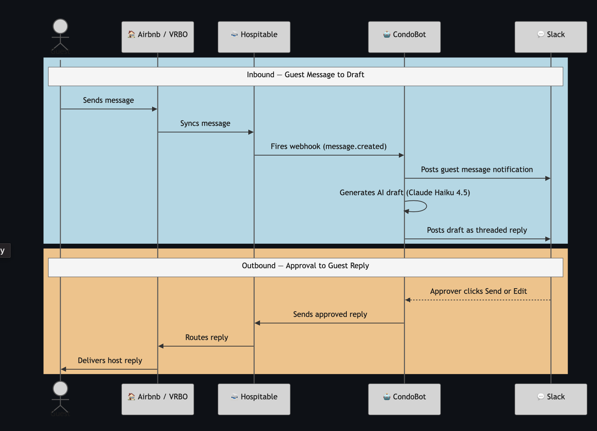
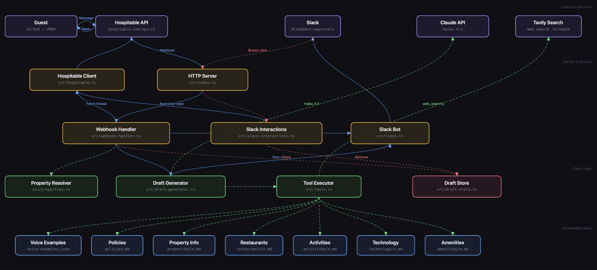

  

# CondoBot

An AI-powered guest messaging system for our vacation rental condos in Kailua-Kona, Hawaii. CondoBot monitors [Hospitable](https://www.hospitable.com) for incoming guest messages, drafts replies that match Cindy's warm and welcoming voice, and posts them to Slack for human approval before sending.

## Flow

  

## Architecture

  

Five layers make up the system: **External Services** (Hospitable, Slack, Claude, Tavily) handle communication with the outside world; **Server & Routes** (Hono HTTP server, webhook handler, Slack interaction handler) receive and dispatch requests; **Core Logic** (draft generator, tool executor, property resolver) orchestrate AI-powered reply composition; the **Knowledge Base** (voice examples, property details, policies, local recommendations) gives the AI grounded, accurate content to draw from; and **Storage** (in-memory draft store) holds pending drafts until approval. Solid blue lines trace data flow, dashed green lines show tool calls into the Claude API and knowledge base, and dotted red lines mark async events like Slack button clicks and draft lifecycle updates.

**Detailed docs:** [Product Requirements (PRD)](docs/PRD.md) | [Engineering Design (EDD)](docs/EDD.md)
