# CondoBot — Engineering Design Document

## Why CondoBot Needs a Standalone Runtime

Claude Code is the development tool — it's how we build, test, and iterate on CondoBot. But Claude Code is not suitable as the production runtime for several reasons:

- **Always-on webhook listener.** CondoBot needs a persistent HTTP server to receive Hospitable webhooks 24/7. Claude Code is an interactive CLI session, not a daemon.
- **Cost control.** CondoBot's per-response work (retrieve knowledge, compose a reply) is well within Haiku 4.5's capabilities at ~$0.005/response. Running these tasks through Claude Code would use Opus or Sonnet at 50–100x the cost.
- **Programmatic control.** A standalone service gives full control over system prompts, tool definitions, prompt caching, retry logic, and conversation threading — none of which are configurable when working through Claude Code's interactive interface.
- **Approval UI.** The service needs to post interactive messages (with Send/Edit buttons) to a shared Slack approval channel and handle callback responses from any approver. This requires a running server with state.
- **Reliability and uptime.** A deployed service can be monitored, auto-restarted, and load-balanced. A Claude Code session cannot.

## Why Bun

**Bun** is the chosen runtime for CondoBot. Key advantages over Node.js:

- **Anthropic acquired Bun in December 2025.** Claude Code itself runs on Bun. The ecosystem alignment means strong long-term support and first-class integration with Anthropic tooling.
- **Runs TypeScript natively.** No compilation step, no `tsconfig.json`, no build pipeline. Write `.ts` files and run them directly.
- **Significantly faster.** Written in Zig using JavaScriptCore (not V8). Faster startup, faster execution, lower memory usage.
- **All-in-one toolkit.** Runtime, package manager (`bun install`), test runner (`bun test`), and bundler — replaces Node.js + npm + Jest + webpack/esbuild.
- **Drop-in Node.js compatibility.** Uses the same `node_modules`, supports most Node.js APIs, runs existing npm packages unchanged.
- **Built-in SQLite driver.** `bun:sqlite` provides a native SQLite interface with no external dependency — ideal for CondoBot's conversation database.

## Developing with Bun (iOS Developer's Guide)

If you've only worked in Xcode + Swift, the Bun/TypeScript workflow will feel surprisingly lightweight. There's no project file, no build phase, no simulator boot. You write a `.ts` file and run it.

### Concept Mapping

| iOS / Swift | Bun / TypeScript | Notes |
|-------------|-----------------|-------|
| Xcode | VS Code | Free, extensible, excellent TS support built in |
| Swift | TypeScript | Statically typed, compiles to JavaScript (Bun does this transparently) |
| Swift compiler | Bun runtime | Bun executes `.ts` files directly — no separate compile step |
| SPM / CocoaPods | `bun add <package>` | Reads `package.json` (like `Package.swift`), installs to `node_modules/` |
| `Package.swift` | `package.json` | Declares dependencies, scripts, and project metadata |
| Xcode build schemes | `package.json` scripts | e.g., `"dev": "bun run --watch src/index.ts"` |
| Simulator / device | `bun run src/index.ts` | Starts a local HTTP server you can hit with curl or a browser |
| `print()` | `console.log()` | Outputs to the terminal |
| XCTest | `bun test` | Built-in test runner, Jest-compatible syntax |
| App Store / TestFlight | Deploy to Railway, Fly.io, or a VPS | `git push` triggers a build on most platforms |

### Daily Workflow

```bash
# Install Bun (one-time)
curl -fsSL https://bun.sh/install | bash

# Initialize a new project (like File > New Project in Xcode)
mkdir condobot && cd condobot
bun init

# Install a dependency (like adding a package in SPM)
bun add hono          # web framework
bun add @anthropic-ai/sdk  # Claude API client

# Run the app (like hitting ⌘R)
bun run src/index.ts

# Run with auto-reload on file changes (like SwiftUI previews, roughly)
bun run --watch src/index.ts

# Run tests (like ⌘U)
bun test
```

### TypeScript for Swift Developers

TypeScript is JavaScript with a static type system bolted on — and it's excellent. Coming from Swift, you'll find familiar concepts:

| Swift | TypeScript | Example |
|-------|-----------|---------|
| `let` / `var` | `const` / `let` | `const name: string = "Cindy"` |
| `String`, `Int`, `Bool` | `string`, `number`, `boolean` | Lowercase primitives |
| `[String]` | `string[]` | `const guests: string[] = []` |
| `String?` (Optional) | `string \| undefined` | Union types replace optionals |
| `protocol` | `interface` | `interface Guest { name: string; email: string }` |
| `enum` | `enum` or union types | `type Status = "pending" \| "approved" \| "sent"` |
| `guard let` | Narrowing / early return | `if (!guest) return;` — TS narrows the type automatically |
| `async` / `await` | `async` / `await` | Nearly identical syntax |
| `struct` | `interface` + plain object | TS doesn't distinguish structs from classes the same way |

The VS Code experience is comparable to Xcode for Swift: inline errors, autocomplete, jump-to-definition, and refactoring — all powered by the TypeScript language server.

### Key Differences from iOS Development

- **No build step.** Bun runs TypeScript directly. There's no equivalent of "waiting for the project to compile."
- **No signing or provisioning.** Deployment is just getting your code onto a server that has Bun installed.
- **Package ecosystem is massive.** npm has ~2.5 million packages. The answer to "is there a library for X?" is almost always yes.
- **Server, not app.** CondoBot is a long-running process that listens for HTTP requests, not a GUI app. Think of it like a REST API that never stops running.
- **Hot reload.** `bun run --watch` restarts automatically when you save a file — faster iteration than even SwiftUI previews.

## Tech Stack

| Component | Technology | Notes |
|-----------|-----------|-------|
| Runtime | Bun (TypeScript) | Runs `.ts` files natively |
| Guest messaging | Hospitable | Webhooks for message events, API for reading/sending messages |
| Draft generation | Anthropic API (Haiku 4.5) | ~$0.005/response |
| Prompt optimization | Prompt caching | System prompt + knowledge base cached; 90% input cost reduction |
| Cleaner coordination | Twilio (Phase 3) | SMS to Bonnie & Darren |
| HTTP framework | Hono | Lightweight, Bun-native, Express-like API |
| Approval channel | Slack (Block Kit) | Shared channel monitored by Josh, Amanda, and Cindy; interactive buttons for Send/Edit; modals for editing drafts |
| Dynamic pricing | PriceLabs | Pushes prices and minimum-stay rules to Hospitable |
| Data storage | SQLite via `bun:sqlite` | Conversation history, guest records |

## Architecture: Tool Use from Day One

Even though Phase 1 is a knowledge-base responder, the system uses Claude's tool-use architecture from the start. The upgrade path from "answer FAQs" to "check calendars and coordinate cleanings" is just adding new tools, not rewriting the core.

### Phase 1 tools (read from local files)

- `lookup_property_info` — property-specific details
- `lookup_policy` — house rules, checkout times, cancellation terms
- `lookup_restaurants` — restaurant recommendations by category
- `lookup_activities` — activity and attraction recommendations
- `lookup_technology` — TV, Wi-Fi, Alexa, and appliance instructions

### Phase 2 tools (hit live APIs)

- `check_calendar_availability` — query Hospitable API for reservation conflicts
- `get_reservation_details` — pull check-in/check-out dates, guest info
- `get_vacancy_windows` — scan Hospitable calendar for upcoming open date ranges
- `get_current_pricing` — retrieve current nightly rates and minimum-stay settings from Hospitable
- `suggest_price_reduction` — propose a price drop and cancellation-period reduction for a vacant window; posts to approval channel

### Phase 3 tools (external coordination)

- `text_bonnie` — send SMS to cleaner via Twilio
- `check_cleaner_schedule` — query cleaner availability
- `send_extension_quote` — calculate and propose pricing for stay extensions

## Proactive Scheduling

Phase 2 introduces CondoBot's first non-reactive behavior. In addition to the existing webhook-driven message pipeline, a periodic job (e.g., daily cron or interval) scans for upcoming vacancies and generates pricing suggestions. This job uses the `get_vacancy_windows` and `get_current_pricing` tools to identify open date ranges, then calls `suggest_price_reduction` to post recommendations to the approval channel for human review.

## Data Storage

### Application Data (CondoBot Runtime)

CondoBot uses **SQLite** (`data/conversations.db`) for all transactional data: conversation history, guest records, draft status, and approval outcomes. SQLite is queryable by guest, date, property, and status — and `bun:sqlite` provides a native driver with no external dependencies.

### Claude Code Development Sessions

When working on CondoBot in Claude Code, the three memory types still apply as a design principle:

| Memory Type | What It Stores | Example | Storage Mechanism |
|-------------|---------------|---------|-------------------|
| Episodic | Lessons learned, operational insights | "Guests frequently ask about parking" | `MEMORY.md` |
| Semantic | Stable facts about the property, people, and area | "The unit has 1-gigabit WiFi"; "Bonnie prefers texts for non-urgent issues" | Knowledge base (this file, property docs) |
| Transactional | Stateful guest-interaction records | "The Smiths asked about March 12–19; awaiting approval on response" | SQLite database |

Most AI-application memory mistakes come from cramming all three types into a single mechanism. Each type has different access patterns, lifespans, and query needs.

### SQLite Schema

Three tables for Phase 1:

```sql
CREATE TABLE reservations (
  id TEXT PRIMARY KEY,                -- Hospitable reservation ID
  property_id TEXT NOT NULL,
  guest_name TEXT,
  platform TEXT CHECK(platform IN ('airbnb', 'vrbo')),
  check_in TEXT,
  check_out TEXT,
  created_at TEXT DEFAULT (datetime('now')),
  updated_at TEXT
);

CREATE TABLE messages (
  id INTEGER PRIMARY KEY AUTOINCREMENT,
  reservation_id TEXT NOT NULL REFERENCES reservations(id),
  hospitable_message_id TEXT UNIQUE,  -- NULL for CondoBot-sent messages
  sender TEXT NOT NULL CHECK(sender IN ('guest', 'host')),
  body TEXT NOT NULL,
  sent_at TEXT NOT NULL,
  created_at TEXT DEFAULT (datetime('now'))
);

CREATE TABLE drafts (
  id INTEGER PRIMARY KEY AUTOINCREMENT,
  reservation_id TEXT NOT NULL REFERENCES reservations(id),
  trigger_message_id INTEGER NOT NULL REFERENCES messages(id),
  body TEXT NOT NULL,                 -- AI-generated draft
  status TEXT NOT NULL DEFAULT 'pending'
    CHECK(status IN ('pending', 'approved', 'edited', 'sent', 'rejected')),
  final_body TEXT,                    -- What was actually sent (original if approved, edited text if edited)
  slack_ts TEXT,                      -- Slack message timestamp for updating the approval message
  reviewer TEXT,                      -- Who approved/rejected
  created_at TEXT DEFAULT (datetime('now')),
  resolved_at TEXT
);
```

**Note:** Schema may need adjustment once we verify against the actual Hospitable API data model (their reservation/message IDs, field names, etc.).

## Webhook Security

Hospitable's webhook signature mechanism needs to be verified during implementation. The webhook handler should validate incoming requests to ensure they originate from Hospitable. This will be designed as a spike task once we have API access and can inspect actual webhook payloads.

## Approval Channel

Drafts are posted to a shared Slack channel (e.g., `#condobot-approvals`) that Josh, Amanda, and Cindy all monitor. Any one of them can approve a draft — whoever sees it first handles it. Once someone clicks Send (or edits and sends), the Slack message updates to show who approved it and when, preventing duplicate sends.

This shared-channel model eliminates single-person bottlenecks. If Cindy is busy, Josh or Amanda can approve, and vice versa. Everyone has visibility into what's being sent to guests.

### Portability

If Slack doesn't work out, alternatives are:

| Alternative | Editing UX | Push Notifications | Swap Effort |
|-------------|-----------|-------------------|-------------|
| **Discord** | Modals (similar to Slack) | Good on mobile | ~1-2 days |
| **Telegram** | Reply-based (no modals) or WebApp (hosted mini-page) | Excellent on mobile | ~1-2 days |
| **Web dashboard** | Full control over UX | Requires adding web push | ~2-3 days |
| **SMS (Twilio)** | Reply with edited text | Native phone notifications | ~1 day |

To keep the swap cost low, `approval-notifier.ts` should define a clean interface that the rest of the system codes against. Slack-specific logic (Block Kit formatting, modal payloads, interaction webhook parsing) stays inside that module. The `slack_ts` column in the `drafts` table would be renamed/replaced for a different platform, but the rest of the schema is platform-agnostic.

Estimated swap effort: **1-2 days** for Discord or Telegram, since the core pipeline (webhook → draft → approve → send) doesn't change.

## Minimal Path to Deployed Server URL

To receive Hospitable webhooks, CondoBot needs a publicly accessible URL. The fastest path:

1. **Initialize the project** — `bun init`, then `bun add hono` for the HTTP framework
2. **Write a minimal webhook handler** — a Hono server with a `POST /webhooks/hospitable` endpoint that logs the incoming payload and returns 200
3. **Pick a host** — Railway (`git push` deploys, free tier, easiest setup), Fly.io (similar, slightly more config), or a VPS (more control, more setup). This is still an open decision (see CLAUDE.md TODO)
4. **Deploy** — push the code and get the public URL (e.g., `https://condobot.up.railway.app`)
5. **Configure the webhook in Hospitable** — go to Apps > Tools > Webhooks > +Add new, select "Messages", paste the URL (e.g., `https://condobot.up.railway.app/webhooks/hospitable`)

Steps 1–2 are ~20 lines of code. Step 3 is the decision point.

## Repo Structure

```
condobot/
├── CLAUDE.md                    # Project context for Claude Code
├── docs/
│   ├── PRD.md                   # Product requirements document
│   ├── EDD.md                   # Engineering design document (this file)
│   ├── hospitable-messaging-api-email.md
│   ├── railway-setup.md
│   └── railway-ui-guide.md
├── knowledge/                   # Knowledge base files read by tools
│   ├── policies.md              # House rules and policies
│   ├── voice-examples.json      # Cindy's voice and tone examples
│   ├── properties/
│   │   └── banyan-tree-300.md   # Property info (amenities, check-in, parking, etc.)
│   └── restaurants/
│       └── kailua-kona.md       # Restaurant recommendations by area
├── prompts/                     # Prompt templates and planning docs
├── scripts/
│   └── test-webhook.sh          # Send a test webhook locally
├── src/
│   ├── index.ts                 # Entry point (HTTP server)
│   ├── webhook-handler.ts       # Receives Hospitable message webhooks
│   ├── draft-generator.ts       # Builds prompt with tools, calls Anthropic API
│   ├── slack.ts                 # Slack Block Kit messages, modals, interaction handlers
│   ├── tools.ts                 # Tool definitions and execution for Claude tool-use
│   └── properties.ts            # Property slug/area resolution
├── package.json
└── tsconfig.json
```

## Flow

This traces a guest message from arrival to response.

### Inbound (guest message to draft)

1. **Guest sends a message** on Airbnb or VRBO (e.g. "What's the Wi-Fi password?").

2. **Hospitable receives it.** Hospitable aggregates Airbnb and VRBO into a unified inbox. It normalizes the message and fires a webhook (`message.created`) to CondoBot's endpoint (`POST /webhooks/hospitable`).

3. **CondoBot receives the webhook** in `index.ts`, which routes it to `webhook-handler.ts`. The handler parses the payload, extracting the guest's name, message body, listing name, platform, and whether they have a reservation.

4. **CondoBot posts a notification to Slack.** `slack.ts` sends the guest's message to the `#condobot-approvals` channel so Josh, Amanda, and Cindy can see it immediately. The Slack message timestamp is saved for threading.

5. **CondoBot generates an AI draft.** `webhook-handler.ts` calls `draft-generator.ts`, which:
   - Loads Cindy's voice examples from `knowledge/voice-examples.json`
   - Builds a system prompt that instructs Claude to reply as Cindy, with rules about tone, Hawaiian words, website URLs (suppressed for unbooked guests), and plain-text formatting
   - Sends the guest message to the Anthropic API (Claude Haiku 4.5) with tool definitions
   - Claude may call tools (`lookup_property_info`, `lookup_restaurants`, etc.) to retrieve knowledge base files — the draft generator executes these via `tools.ts` and feeds the results back in a loop (up to 5 iterations)
   - Claude returns the final draft reply as plain text

6. **CondoBot posts the draft to Slack** as a threaded reply under the original guest message notification.

### Outbound (approval to guest reply) — not yet implemented

7. **An approver reviews the draft** in Slack. They can click Send to approve it as-is, or Edit to modify it first. (Currently drafts are posted as plain text; Block Kit buttons for Send/Edit are planned.)

8. **CondoBot sends the approved reply** to the guest via the Hospitable Messaging API, which routes it back through the original platform (Airbnb or VRBO). The guest sees it as a normal host reply.

### Summary

```mermaid
sequenceDiagram
    actor Guest
    participant Platform as 🏠 Airbnb / VRBO
    participant Hospitable as 📨 Hospitable
    participant CondoBot as 🤖 CondoBot
    participant Slack as 💬 Slack

    rect rgb(230, 245, 255)
        Note over Guest,Slack: Inbound — Guest Message to Draft
        Guest->>Platform: Sends message
        Platform->>Hospitable: Syncs message
        Hospitable->>CondoBot: Fires webhook (message.created)
        CondoBot->>Slack: Posts guest message notification
        CondoBot->>CondoBot: Generates AI draft (Claude Haiku 4.5)
        CondoBot->>Slack: Posts draft as threaded reply
    end

    rect rgb(255, 243, 224)
        Note over Guest,Slack: Outbound — Approval to Guest Reply
        Slack-->>CondoBot: Approver clicks Send or Edit
        CondoBot->>Hospitable: Sends approved reply
        Hospitable->>Platform: Routes reply
        Platform->>Guest: Delivers host reply
    end
```



## Conversation Threading

Currently, each `generateDraft()` call sees only the single incoming guest message. If a guest sends multiple messages in a thread (e.g., asks about parking, then follows up with "and what about the Wi-Fi?"), the model has no context about prior exchanges and may repeat information or miss references.

### The Problem

`draft-generator.ts` starts a fresh `messages` array with one user entry per invocation. The tool-use loop maintains context within a single draft generation (model calls tools, gets results, calls more tools), but nothing persists between webhook-triggered invocations.

### Possible Implementations

**Option A: Fetch thread from Hospitable API at draft time.** When a webhook arrives, call the Hospitable conversations endpoint to retrieve the full message thread. Map each prior message into the Anthropic `messages` array as alternating user/assistant turns before appending the new guest message. This is stateless (no local storage needed) and always reflects the source of truth.

- Pro: Simple, no local state to maintain
- Con: Adds one API call per draft generation; depends on Hospitable API latency

**Option B: Store messages in SQLite locally.** The `messages` table already exists in the schema. On each webhook, persist the guest message, then query the table to reconstruct the thread. After sending an approved reply, store the host message too.

- Pro: Fast local lookups, no extra API call
- Con: State can drift if messages are sent outside CondoBot (e.g., directly in Hospitable); requires backfill logic for existing conversations

**Option C: Hybrid.** Store messages locally for fast reconstruction, but periodically reconcile with Hospitable's API to catch messages sent outside CondoBot.

### Recommendation

Start with **Option A** — it's the simplest and avoids sync issues. The Hospitable API call adds minimal latency compared to the Anthropic API call that follows. If latency becomes a concern, migrate to Option B later.

### Message Format

Prior thread messages would be prepended to the `messages` array before the new guest message:

```typescript
// Pseudocode for thread-aware draft generation
const thread = await fetchHospitableThread(conversationId);
const messages: Anthropic.MessageParam[] = thread.map((msg) => ({
  role: msg.sender === "guest" ? "user" : "assistant",
  content: msg.body,
}));
messages.push({ role: "user", content: `Guest "${guestName}" sent this message:\n\n${newMessage}` });
```

The system prompt would need a note clarifying that earlier messages in the conversation are provided for context, and the model should draft a reply to the most recent guest message only.
